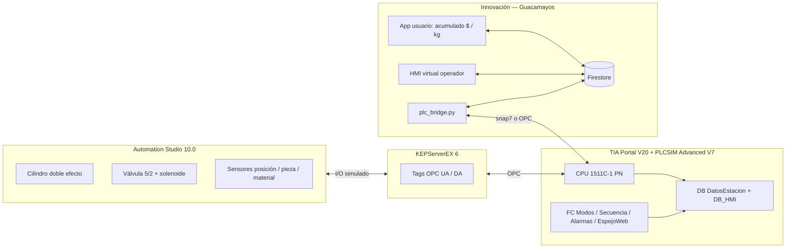
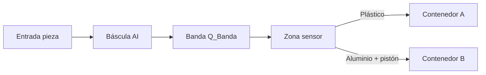
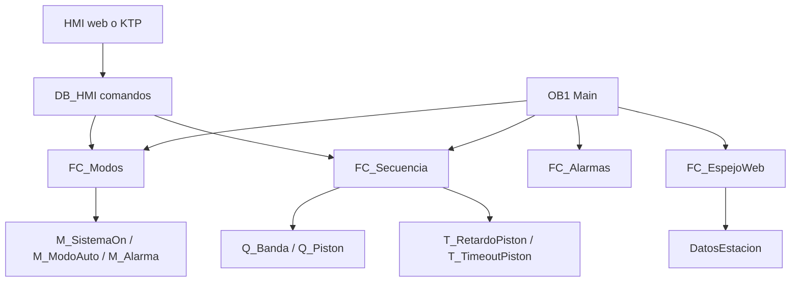
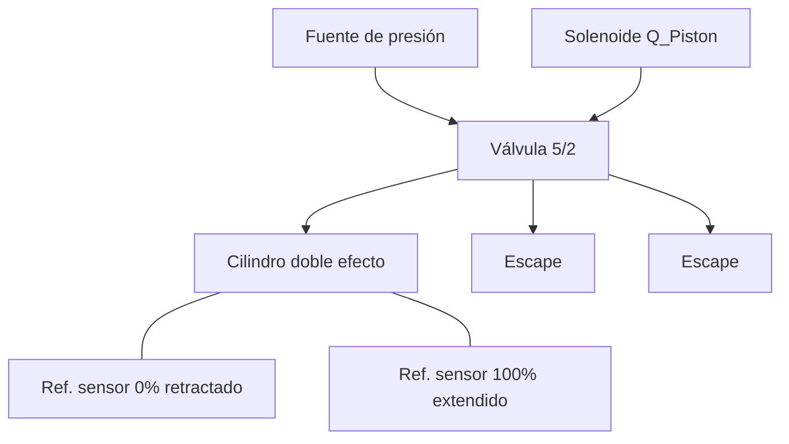

# Arquitectura FINAL — Guacamayos (Siemens Youth 2026)

Versiones y diagrama de lo que estás usando **ahora**.

## Stack confirmado

| Pieza | Software / hardware | Versión / artículo |
|---|---|---|
| Ingeniería PLC | **TIA Portal** | **V20** |
| PLC (simulado) | **CPU 1511C-1 PN** | `6ES7 511-1CK00-0AB0` · FW **V2.9** · DI16/DQ16 · AI5/AQ2 |
| Simulador PLC | **S7-PLCSIM Advanced** | **V7.0** |
| HMI Siemens (opcional) | KTP700 Basic PN | `6AV2 123-2GB03-0AX0` · *Runtime WinCC inestable → ver HMI web* |
| Electroneumática | **Automation Studio** Educational | **10.0** |
| Puente AS ↔ PLC | **KEPServerEX** | **6** (OPC) |
| Innovación / HMI usable | **Guacamayos web** + `plc_bridge.py` | Firestore + snap7 / OPC |

---

## Diagrama general del sistema

---

## Flujo físico (estación)

---

## Diagrama TIA Portal (bloques)

### Hardware TIA (Device view)
- CPU **1511C-1 PN** (onboard DI/DQ/AI/AQ)
- HMI KTP700 Basic PN en misma subred PROFINET **solo si** el Runtime te funciona
- PLCSIM Advanced: instancia con IP virtual (ej. `192.168.0.1`)

### Redes recomendadas
- Softbus / TCP de PLCSIM Advanced según tu instancia  
- IPs ejemplo: PLC `192.168.0.1` · HMI `192.168.0.2` · PG `192.168.0.100`

---

## Diagrama Automation Studio 10

Componentes (nombres AS): ver `automation_studio/COMPONENTES.md`  
Puente a PLC: tags en **KEPServerEX 6** mapeados a entradas/salidas del 1511C / DB_HMI.

---

## Recomendación HMI (importante)

La **KTP700 Basic PN** en simulación con PLCSIM Advanced a menudo falla (error `$190011`, Runtime, certificados).  
**No dependas de ella para la demo del reto.**

### Opción recomendada: HMI virtual en Guacamayos
Cumple el PDF (start/stop, manual/auto, sensores/actuadores, contadores, alarmas) y suma **innovación**:

| Función del PDF | Dónde |
|---|---|
| Encender / detener | Panel HMI web → `DB_HMI` / bridge → PLC |
| Manual / automático | Switch en web |
| Ver sensores y actuadores | Panel estado en vivo |
| Contador de piezas | ContPlastico / ContAluminio |
| Alarmas | Indicadores emergencia / alarma |
| Usuario ve acumulado | Vista “Conectar estación” (ya existía) |

Si más adelante la KTP funciona, puede ser **espejo** de los mismos tags. La web no se tira.

---

## Mapa al enunciado del reto

| Requisito PDF | Cumplimiento |
|---|---|
| TIA Portal + PLC Siemens | CPU 1511C + V20 + PLCSIM Adv V7 |
| Automation Studio electroneumática | AS 10 + cilindro + 5/2 + sensores |
| HMI | **HMI web Guacamayos** (+ KTP si recuperas) |
| Start/Stop, E-Stop, Manual/Auto | FC_Modos + panel web |
| Temporizadores / contadores / secuencia | TON + Cont* en DB |
| Actuadores neumáticos | Q_Piston ↔ AS vía KEPServer |
| Alarmas | FC_Alarmas + UI |
| Innovación | Web usuario + HMI web + puente OPC/snap7 |

---

## Orden de demo (prueba de fuego integrada)

1. PLCSIM Advanced V7 → instancia 1511C en **RUN**  
2. KEPServerEX 6 → tags good  
3. Automation Studio 10 → simulación ON  
4. `python plc_bridge.py <estacion> --ip <IP_PLCSIM_ADV>`  
5. Abrir Guacamayos → **Panel HMI** (operador) + **Conectar** (usuario)  
6. START Auto → sim plástico → sim aluminio → STOP / emergencia  

---

## Dudas / recomendaciones cortas

1. **Sí: HMI en la página Guacamayos** — es lo más estable y puntúa innovación.  
2. Deja la KTP en el proyecto TIA como “intento Siemens nativo”, pero demo con web.  
3. Usa **DB_HMI** (Optimized OFF) para comandos; **DatosEstacion** para espejo hacia la web.  
4. Mantén AS ↔ KEPServer ↔ PLC; la web habla al PLC por **bridge** (snap7 a PLCSIM Advanced o OPC al KEPServer).  
5. No mezcles otra vez Open Controller / PC-System: 1511C + PLCSIM Adv es el camino correcto.
